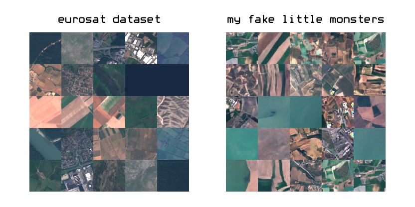

# Diffusion Model with Eurosat Dataset 🛰️
This repo is a modified version of the [Google Colab Notebook](https://colab.research.google.com/drive/1sjy9odlSSy0RBVgMTgP7s99NXsqglsUL?usp=sharing) from [@deepfindr](https://github.com/deepfindr), explained in his [YouTube channel](https://www.youtube.com/watch?v=a4Yfz2FxXiY&list=PLs0Tb3hSGtOeh2Ij4k-8UHzriW1DZBeHh).

## Main Changes ✨
- Switched the original Stanford Cars dataset with the Eurosat dataset, which is a cool collection of satellite images 🌍.
- Added a checkpoint saving feature, so no worries about losing progress during training 💾.
- Since I'm learning the basics of diffusion models, I've added a bunch of comments in the code and markdown cells 📝.

The best model generated during training can be found in [Kaggle](https://www.kaggle.com/models/alvarofg21/eurosat_diffusionmodel). You can also check out some generated images in the `images/` folder

You can have a quick look at the results* in the image above.

** *with a little higher contrast for enhancement ** 😏

Also, i leave here some references that may be useful if you are also learning about diffusion models.

## Useful References for Diffusion Models 🔍

### Must-Read Papers 📚
- [Denoising Diffusion Probabilistic Models](http://arxiv.org/pdf/2006.11239) One of the first publications that uses diffusion models to image generation
- [Diffusion Models Beat GANs on Image Synthesis](http://arxiv.org/pdf/2105.05233) Follow up with several improvements

### The Ultimate Resource List ⚡
For a *serious* dive into diffusion models, check out this epic and kilometric list of resources: [Awesome Diffusion Models](https://github.com/diff-usion/Awesome-Diffusion-Models).

### Quick Intro Videos 🎥
- [AI Coffee Break with Letitia: Introduction to Diffusion Models](https://www.youtube.com/watch?v=344w5h24-h8)
- [AI Coffee Break with Letitia: Time Embeddings](https://www.youtube.com/watch?v=1biZfFLPRSY)
- [Rupert AI: Introduction to U-Nets](https://www.youtube.com/watch?v=NhdzGfB1q74) (Inlcudes memes and background drums, my kinda stuff)*

### Videos with a Math Focus (if you're into yhat) 🔢
- [Deep Dive into Diffusion Models](https://www.youtube.com/watch?v=HoKDTa5jHvg)
- [Diffusion Models and Their Math](https://www.youtube.com/watch?v=fbLgFrlTnGU&list=LL&index=5)

---

Hope this helps you on your journey with diffusion models!
